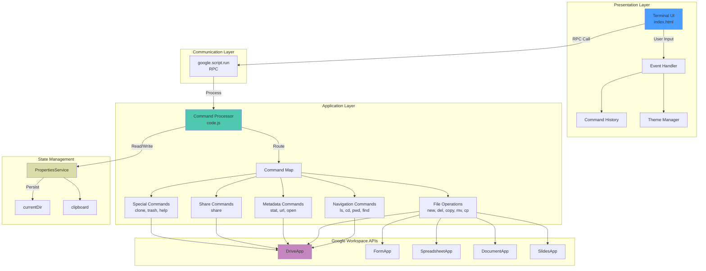
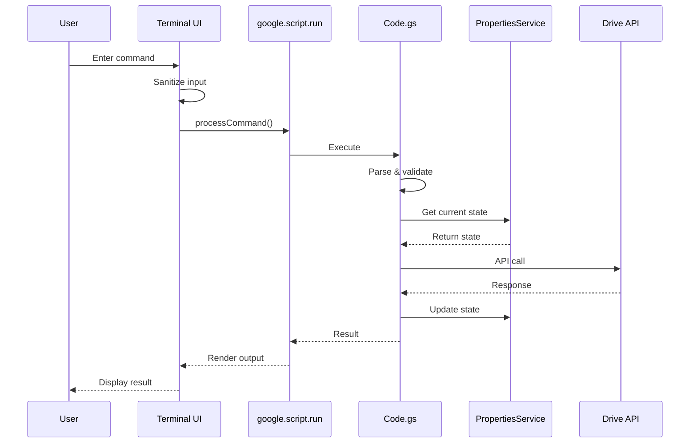
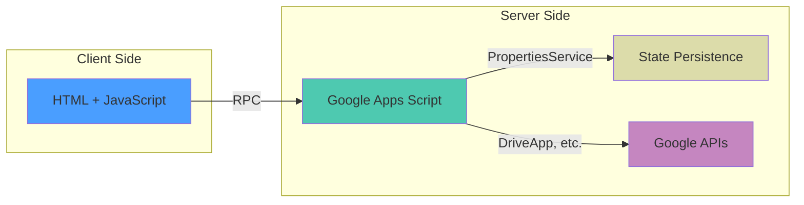

# Google Drive CLI

ブラウザベースのGoogle Drive操作用コマンドラインインターフェース。UNIXライクなコマンド体系でGoogle Driveを操作できます。

## 概要

Google Apps Script (GAS) を使用したブラウザベースのGoogle Drive CLI。ファイル・フォルダの管理、メタデータ操作、共有設定を統一されたインターフェースで実現します。

### 主要機能

- 30個以上のUNIXライクなコマンド
- ディレクトリナビゲーション (cd, pwd, ls)
- ファイル・フォルダ操作 (new, rn, del, copy, paste, mv, cp, touch, mkdir, cat)
- メタデータ表示 (stat, url, open)
- 共有設定 (share)
- Git統合 (clone)
- ゴミ箱管理 (trash)
- UI制御 (dark/lightモード, カラー変更)
- コマンド履歴 (↑↓キー)

### 技術スタック

- **バックエンド**: Google Apps Script (V8 Runtime)
- **フロントエンド**: HTML5 + Vanilla JavaScript (ES6+)
- **API**: Google Drive API, Forms API, Sheets API, Docs API, Slides API
- **通信プロトコル**: `google.script.run` (非同期RPC)
- **状態管理**: PropertiesService (永続化)

## アーキテクチャ



### データフロー



### レイヤー構成



## セットアップ

### ステップ1: プロジェクト作成

1. [Google Apps Script](https://script.google.com) にアクセス
2. 「新しいプロジェクト」をクリック
3. プロジェクト名を「Google Drive CLI」に変更

### ステップ2: ファイル追加

**Code.gs**
1. 既存のCode.gsを削除
2. `/function/code.js` の内容をコピー＆ペースト

**index.html**
1. 左側メニューの「+」→「HTML」をクリック
2. ファイル名を「index」にする
3. `/public/index.html` の内容をコピー＆ペースト

### ステップ3: デプロイ

1. 右上の「デプロイ」→「新しいデプロイ」をクリック
2. 「種類の選択」→「ウェブアプリ」を選択
3. 設定:
   - **説明**: v2.0
   - **次のユーザーとして実行**: 自分
   - **アクセスできるユーザー**: 自分のみ（推奨）
4. 「デプロイ」をクリック

### ステップ4: 権限承認

初回アクセス時、以下の権限が必要：
- Google Driveのファイルとフォルダの表示、編集、作成、削除
- Google Forms, Sheets, Docs, Slidesの作成・管理

## 基本的な使い方

```bash
# ヘルプを表示
> help

# ファイル一覧
> ls

# ディレクトリ移動
> cd Documents

# 現在のパスを表示
> pwd

# ファイル作成
> new report.txt file

# フォルダ作成
> mkdir Projects

# ファイル情報
> stat report.txt

# ファイル共有
> share report.txt user@example.com view

# Git リポジトリをクローン
> clone https://github.com/user/repository

# ファイル移動
> mv report.txt Documents

# ファイルコピー
> cp report.txt Backup

# ファイル内容表示
> cat notes.txt

# ゴミ箱確認
> trash

# ファイル削除
> del report.txt

# ゴミ箱から復元
> trash report.txt restore
```

## コマンド一覧

### ナビゲーション
- `ls` - ファイル一覧
- `ls tree` - ツリー表示
- `pwd` - 現在のパス
- `cd <path>` - ディレクトリ移動
- `find <name>` - ファイル検索

### ファイル操作
- `new <name> <type>` - 新規作成 (type: file, dir, form, sheet, docs, slide)
- `touch <name>` - 空ファイル作成
- `mkdir <name>` - フォルダ作成
- `rn <old> <new>` - 名前変更
- `del <name>` - 削除（ゴミ箱へ）
- `copy <name>` - クリップボードにコピー
- `paste` - クリップボードから貼り付け
- `mv <src> <dst>` - 移動
- `cp <src> <dst>` - コピー
- `cat <name>` - ファイル内容表示

### メタデータ
- `stat <name>` - 詳細情報
- `url <name>` - URL取得
- `open <name>` - 新しいタブで開く

### 共有
- `share <name> <email> <type>` - ユーザーと共有 (type: view, edit, comment)
- `share <name> --link <type>` - リンク共有
- `share <name> --list` - 共有設定一覧

### ゴミ箱
- `trash` - ゴミ箱一覧
- `trash <name> restore` - 復元

### UI制御
- `clear` - 画面クリア
- `reload` - リロード
- `exit` - 終了
- `color <color>` - 色変更 (white, blue, green, red, yellow, cyan, magenta, black)

### 特殊
- `clone <URL>` - Git リポジトリをクローン
- `help` - ヘルプ表示

## ドキュメント

詳細なコマンドリファレンスは [docs/command-detail.md](docs/command-detail.md) を参照してください。

## ライセンス

MIT License

---

**バージョン**: 2.0.0
**最終更新**: 2025-11-13
**対象ランタイム**: Google Apps Script V8
**対象ブラウザ**: Chrome, Firefox, Safari (最新版)
